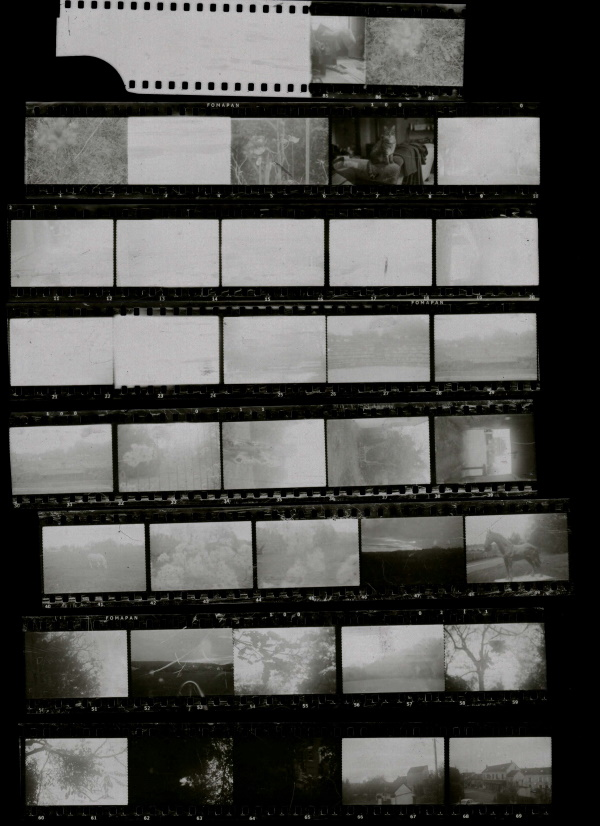

+++
Type = "post"
Title = "In Search of Imperfection: Film Photography"
Date = "2020-11-28T09:04:10.0766574+02:00"
categories = [ "photography" ]
tags = [
    "photography",
    "film-photography",
    "black-and-white",
    "errors"
]
image = "/posts/2020/11-28-in-search-of-imperfection-film-photography/ContactStrip_20201123_thumb.jpg"
+++

I've been thinking about trying some film photography for a while now. There's a couple of reasons for this:

- Digital photography is great, but the lack of limits means you take a tonne of photos then need to spend a serious amount of time in front of the computer sifting through them

- Camera equipment these days is so damn good, that anything other than technical perfection, has become unacceptable

<!--more-->

The first reason is fairly self-explanatory but it's probably worth digging to the second reason a bit more. When you look at the street photography of people like [William Klein](https://duckduckgo.com/?q=William+Klein+street+photography&atb=v248-5&iax=images&ia=images) and [Ed van der Elsken](https://duckduckgo.com/?q=love+on+the+left+bank&t=ffab&atb=v248-5&iax=images&ia=images) they produced some beautiful and lovable images. But many of their images lack technical perfection, there's grain, sometimes a lot of grain, perhaps there's some movement blur, perhaps the lighting could have been improved, but despite these imperfections - or even perhaps because of - the images are still beautiful.

With the technical improvement in digital photography these kind of imperfections have become unacceptable. This made me want to try film photography. I don't expect to reach William Klein's or Ed van der Elsken's level simply by using film instead of digital, after all they are/were world renowned photographers. I would like to see if I could have a few happy accidents.

I mail ordered some film and bought myself a [King Regula Sprinty CC 300](https://camerapedia.fandom.com/wiki/King_Regula_Sprinty) and shot my first roll of film. The results are below.

I was most worried about under exposing my 100 ISO film, but it turned out I had exactly the opposite problem, too many images came out over exposed!

As I developed the film myself, I struggled to get the film from the camera to the developing tank. Scratch and bend marks are visible on the film because of this.

I used a standard flat bed scanner, rather than a chemical process, to create the contact sheet. This isn't ideal, since some of the negatives where an image is clearly visible when you hold the film to the light, don't show up on the scan. I shall have to find another way to create my contact sheet. (I'm fine with this being digital, after all the images will need to digitalized at some point if they are shared). I have a few ideas how I can do this better.

Overall, I enjoyed the experience of developing a film and I'm happy with the results. The sprockets, the numbers and scratches do give a certain romance to the contact sheet even if few of the images are visible. 